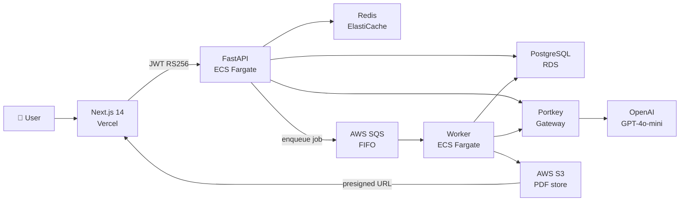
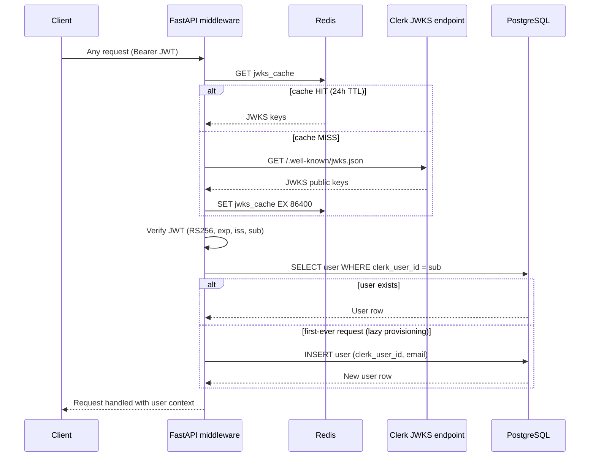
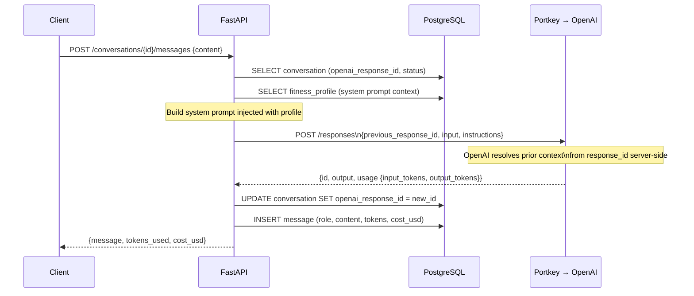
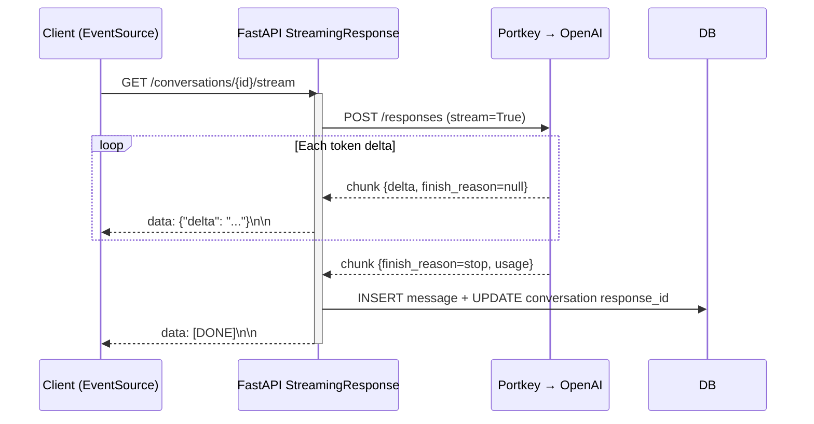
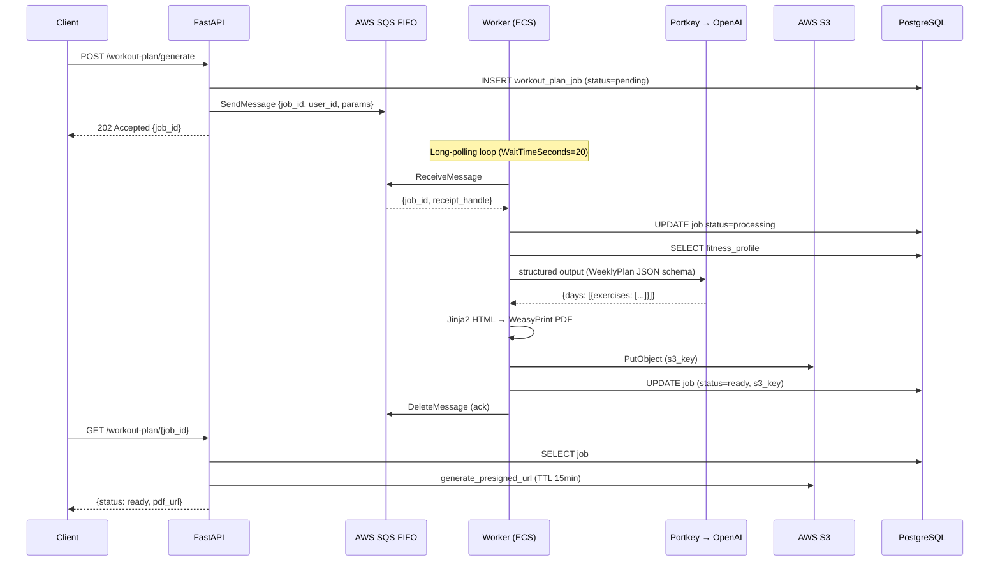
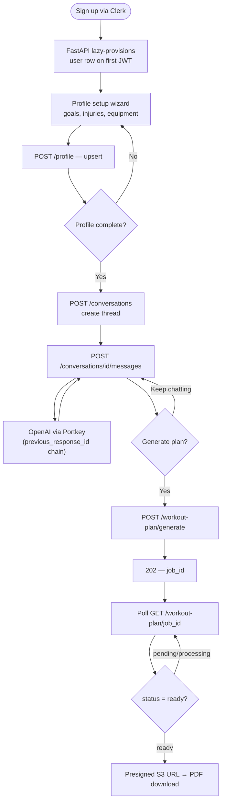
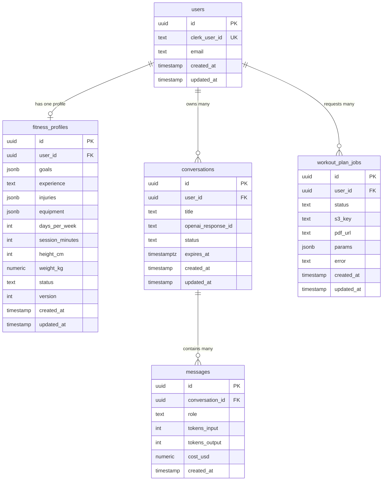
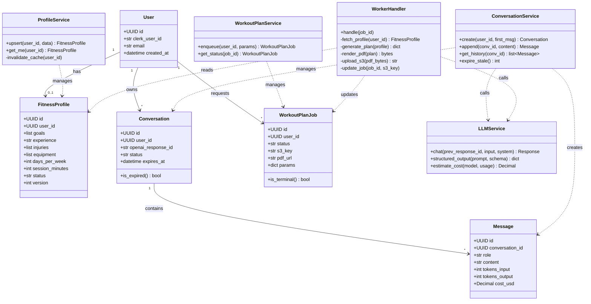

# FitMentor — Architecture & Key Flows

Reference doc for interviews, onboarding, and project understanding.
See [ROADMAP.md](ROADMAP.md) for the phase-by-phase build plan.

---

## Flow Diagrams

### 1. System architecture

---

### 2. Auth + lazy user provisioning

> **Interview hook:** How do you validate JWTs without a DB call to an auth server on every request?

---

### 3. Multi-turn chat (Responses API + response_id chaining)

> **Interview hook:** How do you maintain conversation memory without sending full history in every LLM call?

---

### 4. SSE streaming

> **Interview hook:** How do you stream LLM tokens to the browser without WebSockets?

---

### 5. Async workout plan — SQS claim-check pattern

> **Interview hook:** How do you handle long-running LLM jobs without blocking the HTTP response?

---

### 6. User journey end-to-end

---

## Schema diagram (ER)

> **Interview hook:** Walk me through your data model and why you chose these relationships.

**Key design decisions:**
- `users.clerk_user_id` — Clerk is source of truth; we store a local row for FK relationships only (lazy-provisioned on first JWT)
- `fitness_profiles.goals / injuries / equipment` — JSONB for flexibility; shape changes as product evolves without migrations
- `conversations.openai_response_id` — stores last Responses API ID, enabling multi-turn memory server-side without sending full history
- `workout_plan_jobs.pdf_url` — presigned URL refreshed on each `GET`; never stale in DB
- `messages.cost_usd` — tracked per message for observability and rate-limit budgeting

---

## Class diagram (service + ORM layer)

> **Interview hook:** How is your backend code organised? What does the service layer do?

**Layering rule:** routers → services → repositories → ORM models. Services own business logic; repositories own DB queries; routers own HTTP shape only.
